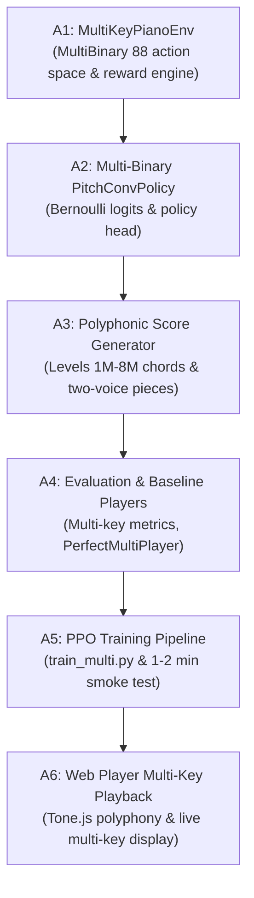

# Stage A Implementation Plan: Multi-Key Pressing (Free Keys)

## Executive Summary

In Milestones 1 through 2 (Levels 1 to 8), our piano agent was constrained to striking at most **one key per time step** (`Discrete(89)`). This single-note restriction was intentional: it allowed us to verify the reinforcement learning loop, design an effective lookahead score window, diagnose error modes, and invent our parameter-sharing `PitchConvPolicy` without dealing with complex polyphony.

Real piano music, however, is inherently polyphonic: pianists play melodies in the right hand while playing chords, basslines, or counter-melodies in the left hand. 

**Stage A** unlocks multi-key pressing ("free keys" polyphony). The agent will be able to strike **any combination of the 88 piano keys simultaneously** at each 16th-note step (e.g., striking 0 keys, 1 key, a 3-note chord, or two keys at opposite ends of the piano) without physical hand or finger constraints yet. Physical biomechanics (hands, wrists, fingers) will be introduced in subsequent stages.

---

## 1. Architecture & Action Space

### 1.1 New Environment: `MultiKeyPianoEnv`
To preserve backward compatibility, we will **not** modify `PianoFreeKeysEnv`. All existing single-key models, checkpoints (`checkpoints/all_pitch_conv/`), evaluation scripts, and unit tests will remain 100% intact.

Instead, we will create a dedicated new environment class:
- **Location**: `src/pianorl/env/multi_keys_env.py`
- **Class Name**: `MultiKeyPianoEnv(gym.Env)`
- **Action Space**: `gymnasium.spaces.MultiBinary(88)`

#### How `MultiBinary(88)` Works in Plain English:
- In the single-key environment (`Discrete(89)`), the agent picked a single number between 0 and 88:
  - `0` = rest (press nothing).
  - `k` = press key $k$ (MIDI pitch $20 + k$).
- In `MultiBinary(88)`, the agent outputs a list of 88 binary switches (zeros and ones):
  - Index `0` $\to$ Key 1 (MIDI pitch 21 / A0): `0` = do not strike, `1` = strike.
  - Index `1` $\to$ Key 2 (MIDI pitch 22 / A#0): `0` = do not strike, `1` = strike.
  - ...
  - Index `87` $\to$ Key 88 (MIDI pitch 108 / C8): `0` = do not strike, `1` = strike.
- Striking no keys (rest) is simply a vector of all zeros: `[0, 0, ..., 0]`.
- Striking a C-major chord (C4=60, E4=64, G4=67) means setting indices `39`, `43`, and `46` to `1` and all other 85 switches to `0`.

### 1.2 Adapting `PitchConvPolicy` for Multi-Binary Decisions
Our shared 1D convolution (`PitchConvPolicy`) is already architecturally suited for this change:
- **Observation Input**: Identical to single-key mode — a lookahead score window `(2 channels, 88 keys, 16 slots)`, normalized tempo, and beat position.
- **Per-Key Convolutional Feature Extractor**: The 1D convolution slides over the 88 pitch rows, producing a feature representation for each of the 88 keys with shared weights.
- **Actor Output Head**:
  - In `Discrete(89)` mode, the network flattened all key features and produced 89 categorical logits passed through a Softmax function (where probabilities across all 89 choices sum to 1.0, forcing the agent to pick exactly one choice).
  - In `MultiBinary(88)` mode, each key's final layer outputs an **independent Bernoulli logit** $z_i \in \mathbb{R}$ for key $i \in \{1, \dots, 88\}$.
  - The probability of pressing key $i$ is calculated independently using a Sigmoid function:
    $$\sigma(z_i) = \frac{1}{1 + e^{-z_i}}$$
  - Stable-Baselines3 has native support for `MultiBinary` action spaces via its `BernoulliDistribution`. It computes independent log-probabilities for each key:
    $$\log P(a) = \sum_{i=1}^{88} \left[ a_i \log \sigma(z_i) + (1 - a_i) \log (1 - \sigma(z_i)) \right]$$
  - This allows the agent to decide whether to press key 60 completely independently of whether it presses key 64 or key 67!

---

## 2. Rewards & Anti-Hedging Mechanics

### 2.1 Multi-Key Scoreboard Rules
At step $t$, let the set of struck pitches be $P_{\text{struck}} = \{21 + i \mid a_i = 1\}$. Let $T$ be the list of all note targets for the current piece.

1. **Exact Timing Match**:
   - For each struck pitch $p \in P_{\text{struck}}$:
   - Search for an unmatched target $t_j \in T$ with pitch $p$ and exact start step `start_step == t`.
   - If found: mark target $t_j$ as matched, award **`hit_exact` (+1.0)**.
2. **Off-by-One Timing Match**:
   - For remaining unmatched struck pitches in $P_{\text{struck}}$:
   - Search for an unmatched target $t_j \in T$ with pitch $p$ and `abs(start_step - t) == 1`.
   - If found: mark target $t_j$ as matched, award **`hit_off_by_one` (+0.5)**.
3. **Wrong Strikes (Unmatched Extra Presses)**:
   - Any struck pitch $p \in P_{\text{struck}}$ that did not match an active target incurs **`wrong_press` (-0.5)**.
4. **Missed Notes**:
   - At step $t$, any target $t_j \in T$ whose window has passed (`t >= start_step + 1`) and remains unmatched incurs **`miss` (-1.0)** and is flagged to prevent duplicate penalties.

### 2.2 Anti-Hedging & Anti-Spam Design
In single-key mode, the agent could only press 1 key per step, so "spamming" was limited to repeatedly striking around a note. In multi-key mode, a naive agent might try to press **all 88 keys simultaneously** or "shotgun" a cluster of 10 keys if the penalty structure is unbalanced.

#### Why Shotgunning Fails Under Balanced Penalties:
Suppose a chord has 3 notes at step $t$.
- **Case A (Accurate play)**: Agent presses only the 3 correct keys.
  $$\text{Reward} = 3 \times (+1.0) = \mathbf{+3.0}$$
- **Case B (Hedging/Spamming 10 keys)**: Agent presses the 3 correct keys plus 7 random extra keys.
  $$\text{Reward} = 3 \times (+1.0) + 7 \times (-0.5) = +3.0 - 3.5 = \mathbf{-0.5} \quad (\text{Net Loss!})$$
- **Case C (All-key strike: 88 keys)**:
  $$\text{Reward} = 3 \times (+1.0) + 85 \times (-0.5) = +3.0 - 42.5 = \mathbf{-39.5} \quad (\text{Catastrophic Loss!})$$

#### Key Guardrails:
1. **Strictly Negative Speculation Value**: For any key press where the agent's confidence of a hit is below $33\%$ ($p < 0.33$), the expected reward is strictly negative:
   $$\mathbb{E}[R] = p \times (+1.0) + (1-p) \times (-0.5) < 0 \iff p < \frac{0.5}{1.5} \approx 0.33$$
2. **Entropy Regularization Tuning**: For `MultiBinary(88)`, entropy is summed across 88 binary distributions. A standard entropy coefficient (`ent_coef = 0.01`) can be 88 times larger in magnitude than in categorical spaces, causing the agent to output random coin-flips (~44 keys pressed per step!). We will scale `ent_coef` down to `0.0005`–`0.001` to encourage clean, sparse key presses.
3. **Per-Key Initial Logit Bias**: Initialize the final linear layer bias to `-3.0` (or similar negative value) so that at step 0 of training, the probability of pressing each key is $\sigma(-3.0) \approx 0.047$ (sparse / mostly silence) rather than $\sigma(0.0) = 0.5$ (pressing 44 keys at once).

---

## 3. Two-Voice Procedural Generator (Polyphony Curriculum)

To teach the model to use both hands / independent voices, we will expand our procedural score generator with a two-voice engine in `src/pianorl/score/generator_poly.py` (or `generator.py` extension):

### Structure of Two-Voice Scores:
- **Upper Voice (Voice 1 / Treble)**: Plays the primary melody, fast runs, or theme in the upper registers (pitches 60 to 96 / C4 to C7).
- **Lower Voice (Voice 2 / Bass)**: Plays root notes, fifths, chord accompaniment, or walking counterpoints in the lower registers (pitches 36 to 60 / C2 to C4).
- Both voices share the same tempo and global beat clock, but note onsets can occur together (block chords) or at different time steps (polyphonic rhythm).

### Multi-Key Curriculum Levels (Levels 1M to 8M):
1. **Level 1M (Synchronized Dyads)**:
   - 2 notes struck simultaneously at every quarter note (e.g., root note in bass + melody note in treble, 1 beat duration, 5-key spans).
   - Teaches the model that two keys can be pressed at the exact same moment.
2. **Level 2M (Melody over Drone/Pedal Note)**:
   - Lower voice holds long notes (2 to 4 beats) while upper voice plays moving notes (1 beat).
   - Teaches the model to strike a treble note while a bass note was already struck or resting.
3. **Level 3M (Melody + Triad Chords)**:
   - Treble melody accompanied by root-position major/minor triads (3 simultaneous keys in left hand).
   - Teaches handling 3 to 4 simultaneous keys.
4. **Level 4M (Alberti Bass & Arpeggiated Polyphony)**:
   - Broken chords in the left hand (e.g. C-G-E-G 8th notes) under a slower right-hand melody.
   - Tests alternating single-key and multi-key moments.
5. **Level 5M (Full Keyboard Chromatic Polyphony)**:
   - Black keys included across all 12 keys; 2-3 simultaneous voices spanning wide registers.
6. **Level 6M (Polyphonic Scales & Parallel Harmony)**:
   - Thirds and sixths moving together; major and minor scale duets.
7. **Level 7M (Contrapuntal Melodies with Independent Rhythms)**:
   - Two voices with independent rhythms (e.g., dotted rhythms in voice 1, syncopated 8th notes in voice 2).
8. **Level 8M (Fast Polyphony & Ornaments)**:
   - Rapid 16th-note runs in right hand over staccato chord punches in left hand at 100–130 BPM.

---

## 4. Time Resolution Check: 16th-Notes vs. 32nd-Notes

The user requested an analysis of staying on the **16th-note grid** (4 steps/beat) versus moving to **32nd-notes** (8 steps/beat), especially concerning fast pieces like *Rush E*.

### Comparison Table:

| Metric | 16th-Note Grid (`steps_per_beat = 4`) | 32nd-Note Grid (`steps_per_beat = 8`) |
| :--- | :--- | :--- |
| **Time step duration at 120 BPM** | $125 \text{ ms}$ | $62.5 \text{ ms}$ |
| **Steps for a 32-beat piece** | $128 \text{ steps}$ | $256 \text{ steps}$ |
| **Observation Window Size** | $2 \times 88 \times 16 = 2,816 \text{ floats}$ | $2 \times 88 \times 32 = 5,632 \text{ floats}$ |
| **CPU Training Speed** | **Fast** (~4,000–6,000 steps/sec on CPU) | **~2x Slower** (~1,800–2,500 steps/sec) |
| **Can play 16th-note runs?** | Yes, exact | Yes, exact |
| **Can play 32nd-note runs?** | No (rounded to nearest 16th) | Yes, exact |
| **Can play rapid repeated notes?** | Up to 4 strikes/beat (8 Hz at 120 BPM) | Up to 8 strikes/beat (16 Hz at 120 BPM) |
| **Fit for *Rush E*?** | Can play Rush E at half-tempo / simplified | Required for full-speed authentic Rush E runs |

### Recommendation for Stage A:
- **Keep 16th-note resolution (`steps_per_beat = 4`) for Stage A**.
- **Reasoning**:
  1. Transitioning to `MultiBinary(88)` is already a major learning transition for the policy (learning 88 independent action distributions instead of 1 categorical distribution). Doubling the time horizon and doubling the lookahead observation size at the same time would slow down CPU iteration speed by 2x to 3x.
  2. All 1,600 pieces in our existing dataset and loader pipelines operate at 16th-note resolution.
  3. Our architecture should parametrize `steps_per_beat` cleanly so that when we tackle Milestone 7 (Rush E), upgrading to `steps_per_beat = 8` requires changing only a single configuration parameter without rewriting any code.

---

## 5. Step-by-Step Implementation Roadmap

We break Stage A into 6 small, safe, test-driven steps. Each step can be completed, tested with unit tests, and verified without breaking existing single-key functionality:

### Detailed Roadmap:

#### Step A1: `MultiKeyPianoEnv` Environment
- Implement `src/pianorl/env/multi_keys_env.py`.
- Action space: `spaces.MultiBinary(88)`.
- Support multiple simultaneous targets at step $t$.
- Unit tests: verify single notes, chords, misses, wrong presses, and off-by-one matches.
- Ensure all 77 existing tests still pass.

#### Step A2: Multi-Binary `PitchConvPolicy`
- Implement `MultiKeyPitchConvPolicy` in `src/pianorl/agent/pitch_conv_policy.py`.
- Final convolution layer outputs 88 channels $\to$ 88 Bernoulli logits.
- Negative output bias initialization ($\approx -3.0$) to avoid exploratory spam.
- Unit tests: forward pass with random dummy batches; check output distribution and log-prob calculation.

#### Step A3: Polyphonic Score Generator (Levels 1M to 8M)
- Create `src/pianorl/score/generator_poly.py`.
- Implement Levels 1M through 8M (chords, dyads, accompaniment + melody).
- Add dataset generation options for single vs polyphonic splits.
- Unit tests: verify all notes are within 88 keys, on 16th-note grid, with chords present.

#### Step A4: Multi-Key Evaluation Suite & Baseline Players
- Implement `PerfectMultiPlayer` (strikes exact keys for all note onsets at that step).
- Update evaluation metrics to report Chord Recall, Chord Precision, and overall Note F1.
- Unit tests: test baseline players on polyphonic scores.

#### Step A5: Multi-Key Training Pipeline & Smoke Test
- Create `scripts/train_multikey.py` with multi-binary PPO support.
- Run a 1–2 minute smoke test to verify loss decreases and parallel CPU workers function smoothly without memory leaks.

#### Step A6: Live Visual Web Player Polyphony Update
- Update `web/index.html` and `scripts/web_server.py` to stream multi-key arrays.
- Update Tone.js playback to trigger all simultaneously pressed pitches cleanly.
- Verify piano-roll and keyboard light up multiple keys simultaneously.

---

## 6. Summary Checklist for User Review

- [x] Environment: `MultiKeyPianoEnv` using `MultiBinary(88)` without touching `PianoFreeKeysEnv`.
- [x] Policy: `PitchConvPolicy` adapted to output 88 independent Bernoulli logits.
- [x] Rewards: Multi-target matching with strictly negative speculative value to prevent spamming.
- [x] Music Generator: Two-voice polyphony curriculum (Levels 1M to 8M).
- [x] Timing: Retain 16th-note resolution for Stage A, keeping 32nd-notes as an easy one-parameter toggle for Rush E.
- [x] Safety: 6 testable milestones with zero regressions on existing code.
